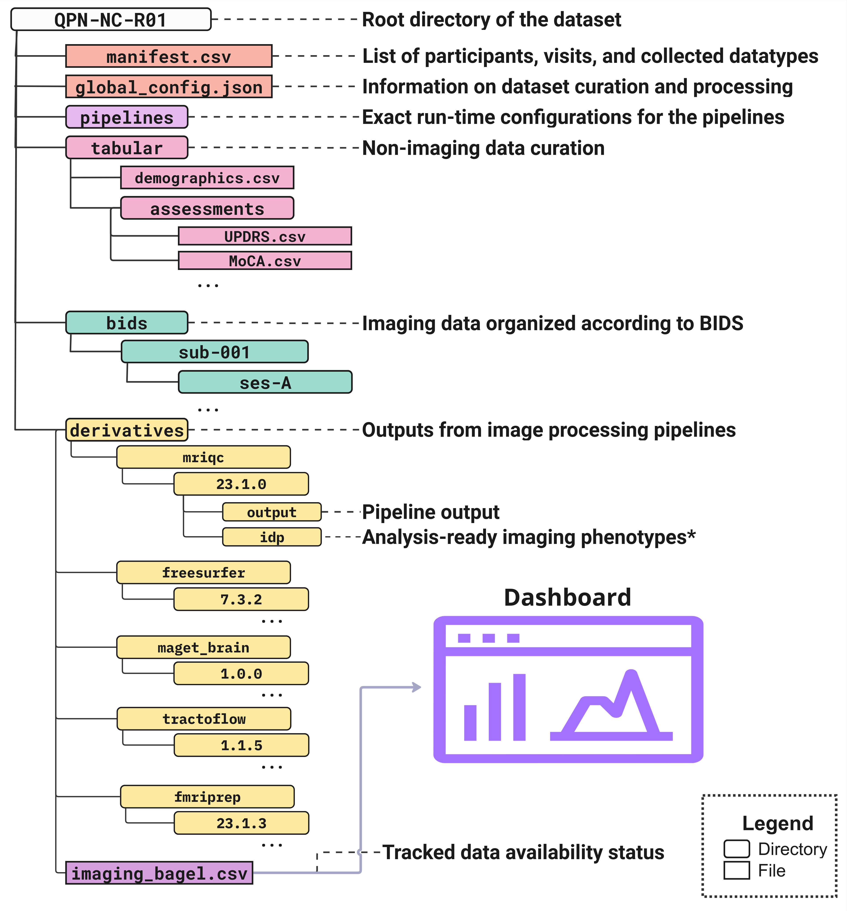

# qpn-analysis

## Overview
This repository contains code used in the analysis of QPN-Neuroimaging cohort (QPN-NC) data-release. QPN-NC imaging data was curated (BIDS) and processed with several pipelines using [Nipoppy](https://nipoppy.readthedocs.io/) tools.

### Processing pipelines
The image processing pipelines include:
1. [MRIQC](https://mriqc.readthedocs.io/): Image quality metrics (IQMs) of T1w and bold
2. [FreeSurfer*](https://surfer.nmr.mgh.harvard.edu/): cortical surface and subcortical volumetric measures
3. [fMRIPrep](https://fmriprep.org/): resting-state functional connectome
4. [TractoFlow](https://github.com/scilus/tractoflow): white-matter tractography using diffusion data
5. [MAGET Brain](https://github.com/CobraLab/MAGeTbrain): cerebellar segmentation and volumetry

Nipoppy uses containers and [Boutiques](https://boutiques.github.io/) to describe and track runtime parameters of these pipelines. This ensures the standardization and reproducibility and allows other users to implement identical processing setup for their data. The pipeline descriptors and run-time invocation configurations are provide in [pipeline](pipeline) directory.

### Image-derived-phenotypes (IDPs)
Jupyter notebooks for descriptive statistics and plotting of IDPs generated from the output of these pipelines is provided in [idp](idp).

### Clinical assessments (tabular data)
Jupyter notebook for descriptive statistics and plotting of clinical scores (i.e. UPDRS, MoCA, Neuropsychological battery) is provied in [clinical_assessments](clinical_assessment).

#### Normalization of neuropsychological assessments
Statistical normalization of raw scores was performed for a subset of neuropsychological instruments using methods based on prior work and literature. The normalization method and "normed" scores are provided inside the `tabular` directory the QPN-NC data release.

## How to run the analysis code

### Dataset organization
The code expects the following data organization according Nipoppy specification:



The local dataset root path is then specified inside a `local_config.json` which is read by all the notebooks. This file can be used to specify other configs (e.g. color palettes) as well.

Here is a sample `local_config.json`:

```
{
    "DATASET_NAME": "QPN-NC",
    "DATASET_RELEASE: "R1"
    "DATASET_DIR": "<>/QPN-NC-R1/",

    "plot_styles": {
        "DX_COLOR_PALETTE": {
            "control": "#8d99ae",
            "PD": "#e63946"
        }
    }
}
```

### Environment dependencies

#### Curation and processing pipelines
The environment setup for running the processing pipelines with Nipoppy is described here: [Nipoppy installation](https://nipoppy.readthedocs.io/en/latest/installation.html)

#### Statistical analysis and plotting
The additional Python packages for analysis and plotting code in this repo are listed here: [pyproject.toml](pyproject.toml)
